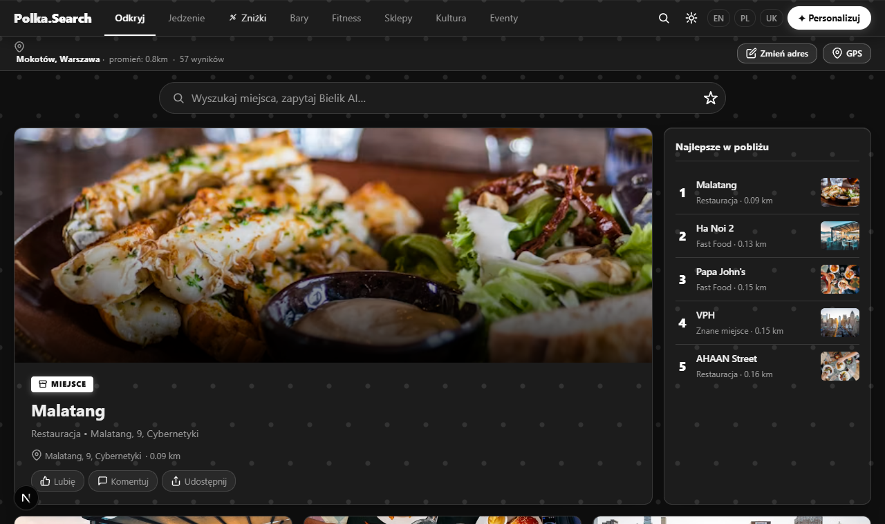

# Polka.Search



**Lokalny agregator miejsc w Polsce.** Wpisz adres lub użyj GPS — aplikacja pokazuje co jest w pobliżu: restauracje, kawiarnie, bary, muzea, eventy i aktualne promocje. Działa w całości na darmowych API.

🌐 **Live:** https://polka-search.vercel.app

---

## Funkcje

- Wyszukiwarka adresów — wpisz miasto lub ulicę, wyniki aktualizują się do nowej lokalizacji
- Lokalizacja GPS — jedno kliknięcie w nazwę miejscowości
- Zakładki kategorii: Odkryj, Jedzenie, Zniżki, Bary, Fitness, Sklepy, Kultura, Eventy
- Pasek newsów NA ŻYWO — lokalne wiadomości z Google News, przeciągany
- Filtrowanie: wg odległości, oceny lub "Otwarte teraz"
- Karta szczegółów miejsca — ocena, godziny, telefon, mapa OSM, udostępnianie
- Prognoza pogody inline — ikona + temperatura + panel 12h/5 dni
- Personalizuj — 17 kategorii do włączenia/wyłączenia (localStorage)
- Modal opinii — w footerze, z kategoriami błędów
- Dark / light mode
- Animowane tło reagujące na kursor
- Pełna responsywność mobilna — taby i filtry scrollują się poziomo
- PWA — można dodać do ekranu głównego (manifest.json)

## Stack

- **Next.js 16.2.9** (App Router, SSR + client components)
- **TypeScript** (strict mode)
- **Tailwind CSS v4**
- **Open-Meteo** — pogoda (darmowe, bez klucza)
- **Nominatim / OpenStreetMap** — geocoding i dane lokalizacji (darmowe, bez klucza)
- **Google News RSS** — lokalne newsy (darmowe, bez klucza)
- **Inter** — czcionka (Google Fonts)

## Uruchomienie lokalne

```bash
npm install
npm run dev
```

Aplikacja działa bez żadnych kluczy API.

## Deploy

```bash
vercel --prod
```

Projekt skonfigurowany na Vercelu jako `mrfilarskis-projects/polka-search`.

## Opcjonalne klucze API (przyszłość)

| Zmienna | Do czego |
|---|---|
| `BIELIK_API_KEY` | Odpowiedzi AI po polsku (bielik.ai) — endpoint już gotowy |

## Struktura projektu

```
app/
  globals.css          # wszystkie style
  layout.tsx           # Inter font, PWA metadata
  page.tsx             # SSR entry point
  api/
    search/route.ts    # wyszukiwanie miejsc (mock → OSM Overpass)
    news/route.ts      # Google News RSS parser
    bielik/route.ts    # Bielik AI (wymaga klucza)
components/
  SearchPage.tsx       # główny komponent aplikacji
  DetailModal.tsx      # modal szczegółów miejsca
  NewsTicker.tsx       # pasek newsów
  FeedbackModal.tsx    # modal opinii
  AiSearchBar.tsx      # pasek wyszukiwania
  PolkaDotBackground.tsx
lib/
  types.ts             # TypeScript interfaces
  search.ts            # logika wyszukiwania
public/
  favicon.svg          # logo P.S z czerwoną kropką
  manifest.json        # PWA manifest
```

## Roadmap

- [ ] Podłączyć OSM Overpass API (prawdziwe dane zamiast mock)
- [ ] Zdjęcia z Wikimedia Commons po nazwie miejsca
- [ ] Prawdziwe godziny otwarcia z tagu `opening_hours` (OSM)
- [ ] Bielik AI w wyszukiwarce
- [ ] Backend dla opinii (Resend / Supabase)
